# Automated Python CI/CD Pipeline using Jenkins and GitHub Actions

## Project Overview

This project demonstrates a fully automated CI/CD pipeline for a Python Flask application using Jenkins triggered by GitHub Actions.

The main objective of this project is to eliminate manual CI/CD execution. Whenever a developer pushes code to the GitHub repository, a GitHub Actions workflow automatically triggers a Jenkins pipeline. Jenkins then builds and deploys the application to the server without any manual interaction.

This setup removes the need to manually start Jenkins jobs. The entire pipeline is controlled using a YAML workflow file and Jenkins remote trigger API.

This project represents a practical DevOps implementation that reflects real-world CI/CD automation workflows.

---

# Architecture Diagram

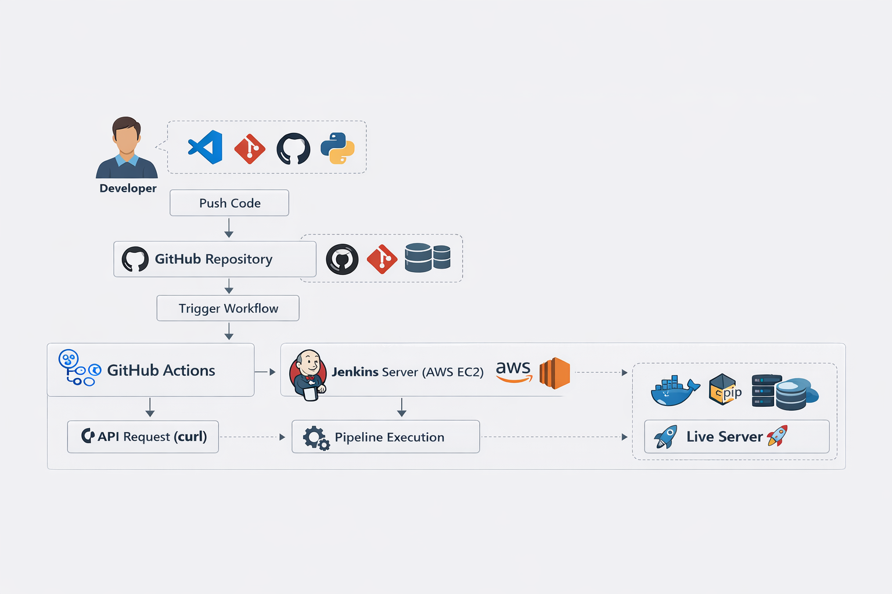

---

# Technology Stack

| Technology | Purpose |
|------------|--------|
| Python | Backend Application |
| Flask | Web Application Framework |
| Jenkins | CI/CD Pipeline Automation |
| GitHub | Source Code Management |
| GitHub Actions | Workflow Automation |
| Git | Version Control |
| AWS EC2 | Jenkins and Application Hosting |
| Linux | Server Environment |
| SSH | Secure Authentication |
| Curl API | Jenkins Job Trigger |

---

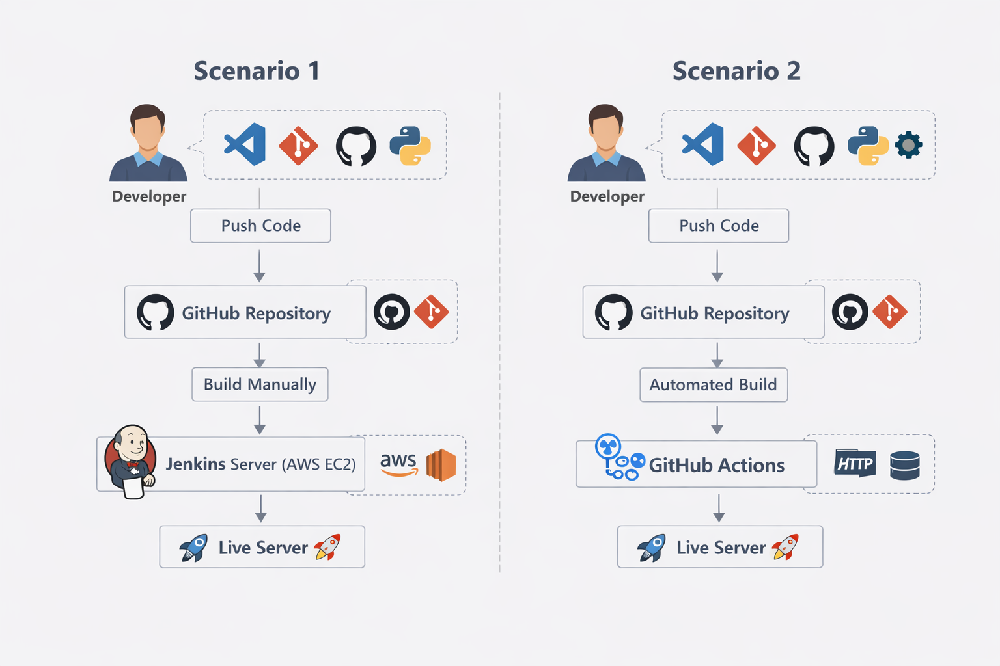

---

# Key Features

- Fully automated CI/CD pipeline
- Automatic Jenkins pipeline triggering
- GitHub Actions workflow automation
- No manual Jenkins build execution
- Secure Jenkins remote trigger using token
- Private GitHub repository integration
- AWS EC2 deployment environment
- SSH authentication configuration
- Automatic build and deployment process

---

# CI/CD Architecture

```
Developer
   │
   │ Push Code
   ▼
GitHub Repository
   │
   │ Trigger Workflow
   ▼
GitHub Actions
   │
   │ API Request (curl)
   ▼
Jenkins Server (AWS EC2)
   │
   │ Pipeline Execution
   ▼
Build + Install Dependencies
   │
   ▼
Deploy Python Application
   │
   ▼
Live Server
```

---

# Project Structure

```
Email-Python-CICD-GitHub-Action
│
├── .github
│   └── workflows
│       └── jenkins-action.yml
│
├── templates
│
├── app.py
├── requirements.txt
├── Dockerfile
├── jenkinsfile
└── README.md
```

---

# How It Works

## Step 1 — Developer Pushes Code

The developer pushes code changes to the GitHub repository.

```
git add .
git commit -m "update"
git push origin master
```


---

## Step 2 — GitHub Actions Workflow Trigger

GitHub detects the push event and automatically runs the workflow defined in the repository.

Workflow file location:

```
.github/workflows/jenkins-action.yml
```

Example workflow configuration:

```yaml
name: Trigger Jenkins Pipeline

on:
  push:
    branches:
      - master

jobs:
  trigger-jenkins:
    runs-on: ubuntu-latest

    steps:
      - name: Trigger Jenkins Job
        run: |
          curl -X POST http://YOUR_JENKINS_IP:8080/job/email/build?token=jenkins-token
```

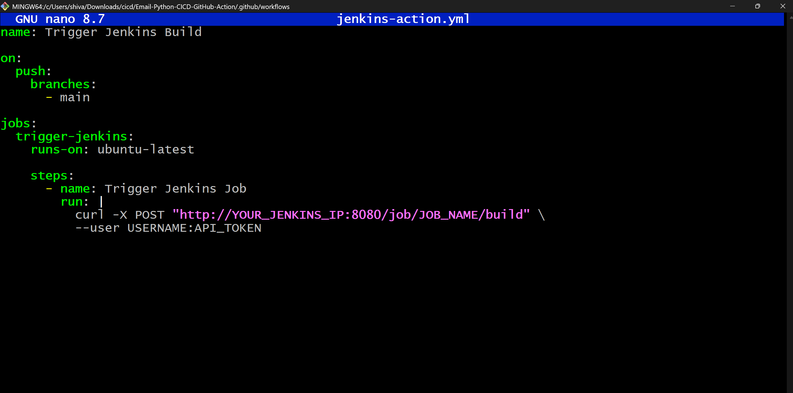

---

## Step 3 — GitHub Actions Sends Request to Jenkins

GitHub Actions sends a POST request to Jenkins using the curl command.  
This request triggers the Jenkins pipeline remotely.

---

## Step 4 — Jenkins Pipeline Execution

Jenkins receives the trigger request and starts executing the pipeline.

Pipeline stages include:

- Cloning the GitHub repository
- Installing required dependencies
- Running the Python Flask application
- Deploying the application to the server

---

## Step 5 — Application Deployment

After successful pipeline execution, the application is deployed automatically on the server.
---

# Jenkins Configuration

## Confihure Secrets and credential
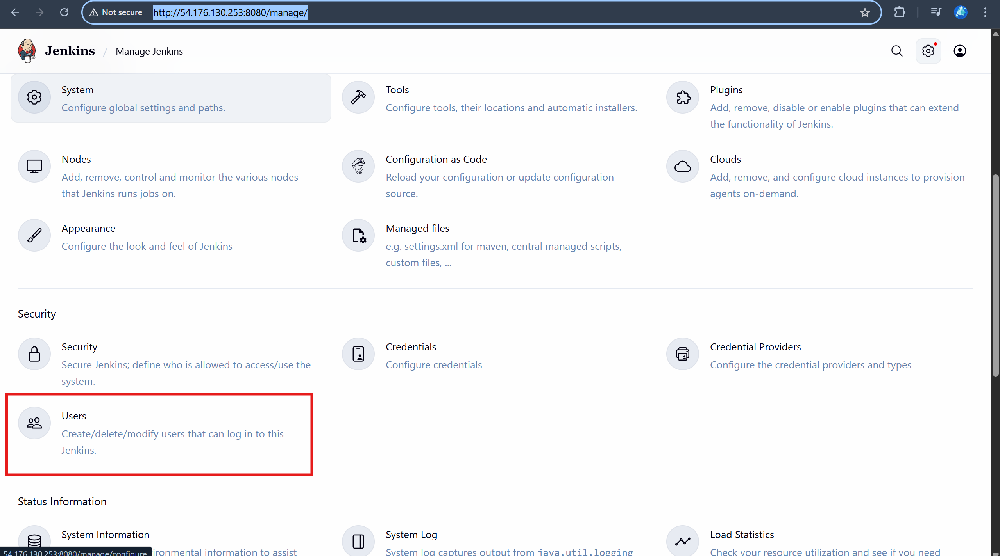
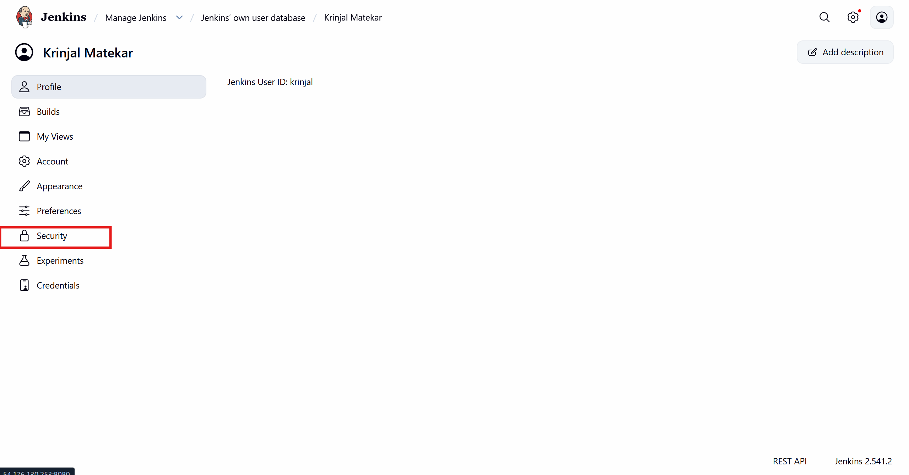

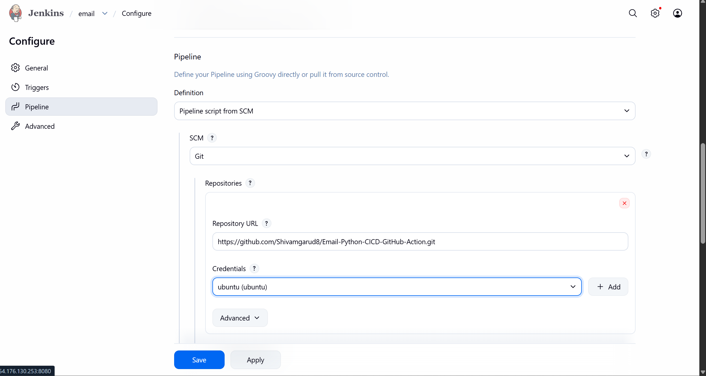
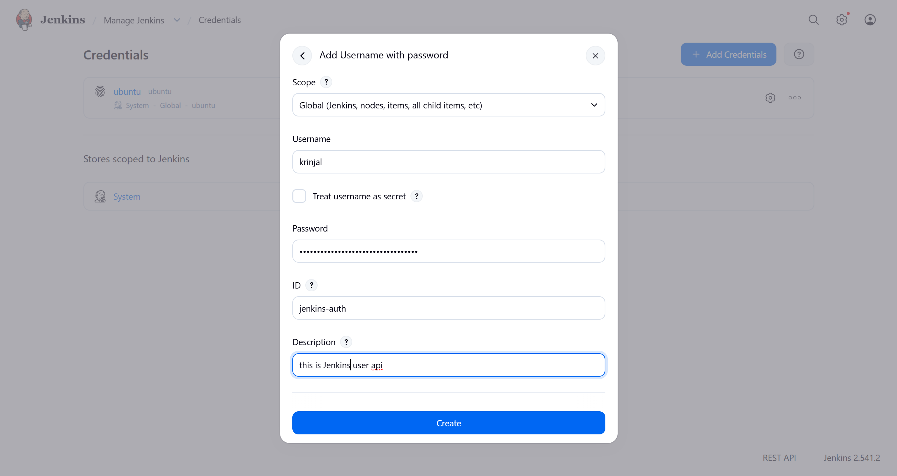

---

## Enabling Remote Trigger

Inside Jenkins Job Configuration:
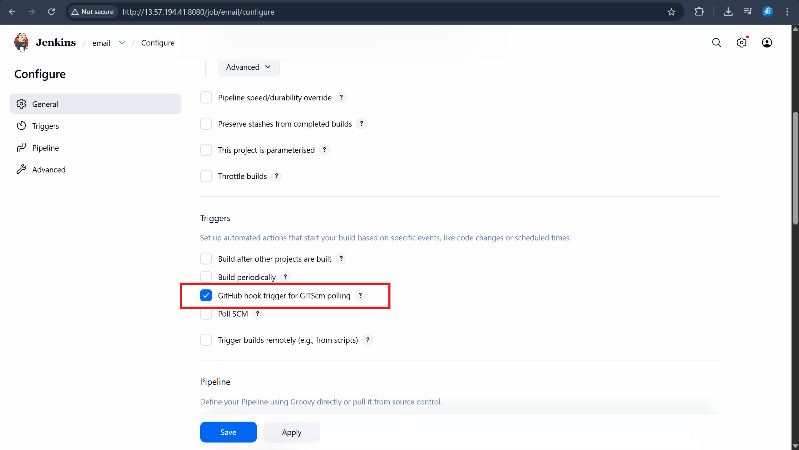
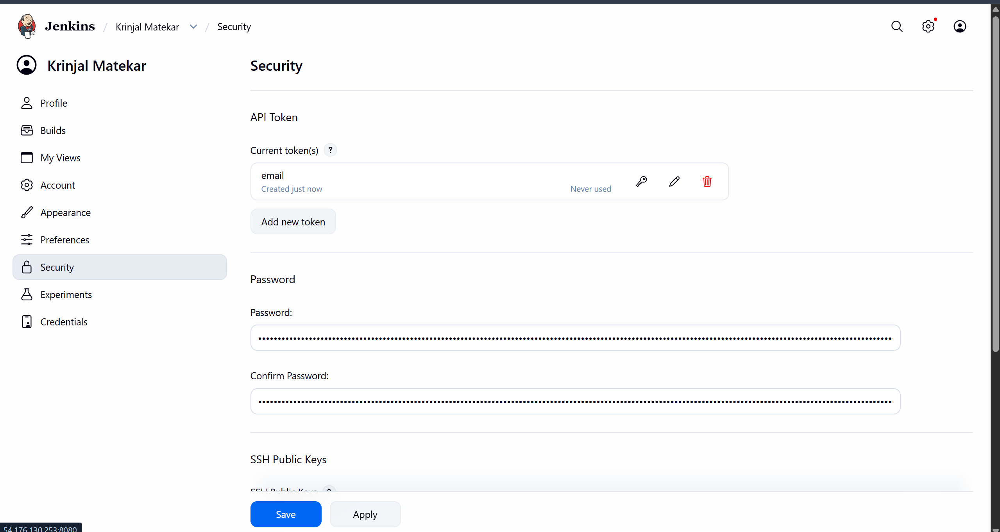
```
Build Triggers

Trigger builds remotely (e.g., from scripts)

Token: jenkins-token
```

This token allows GitHub Actions to securely trigger Jenkins jobs.

---

# Credentials Configuration

Since the GitHub repository is private, Jenkins requires authentication credentials.

These credentials are configured inside Jenkins Credential Manager.

Credentials used:

- GitHub Repository Access Token
- SSH Private Key Authentication


---

# Pipeline Execution Results

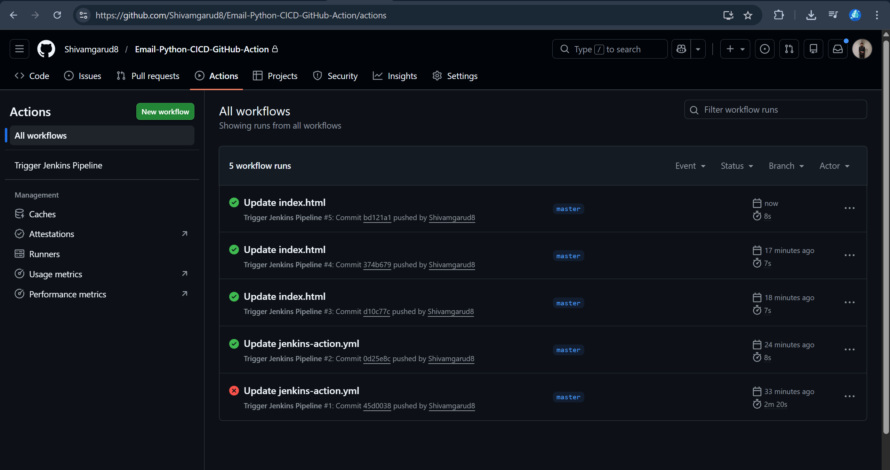

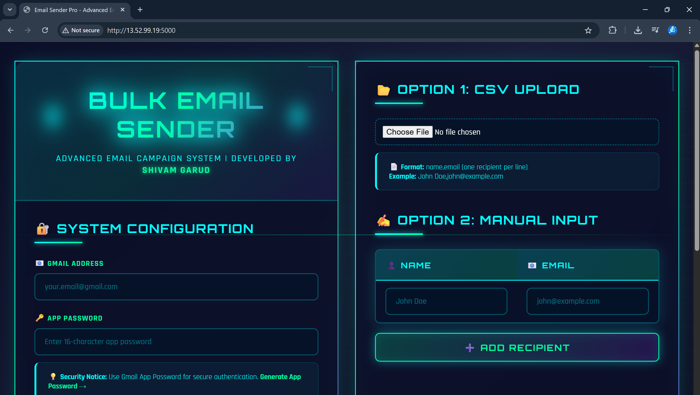

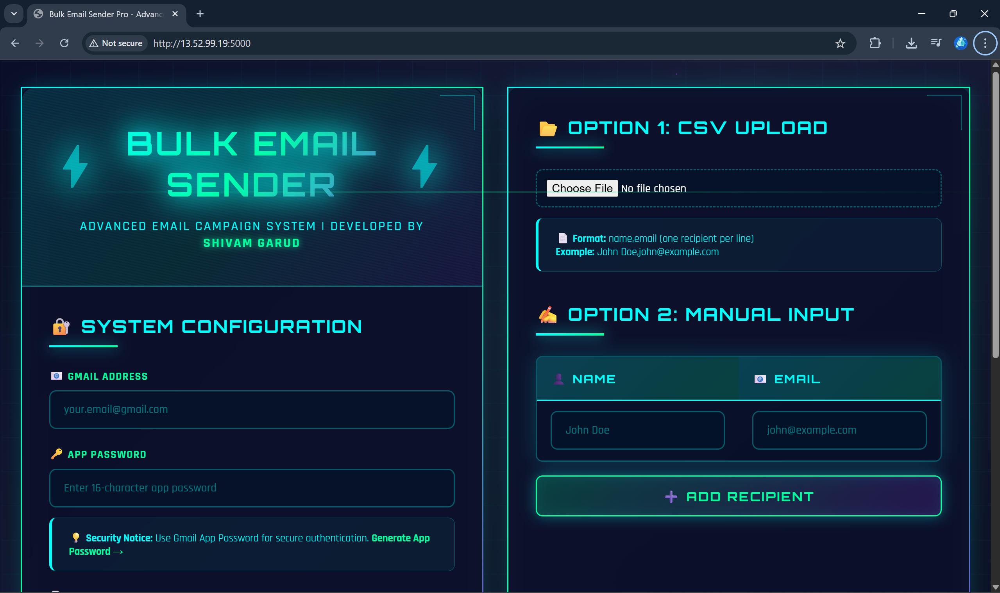

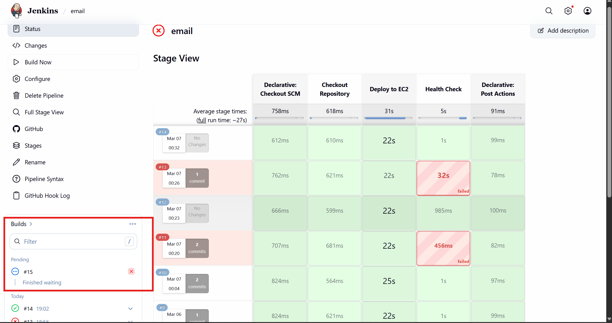

---

# Pipeline Flow Summary

1. Developer pushes code to GitHub.
2. GitHub Actions workflow starts automatically.
3. GitHub Actions triggers Jenkins using a remote API request.
4. Jenkins pipeline begins execution.
5. Application dependencies are installed.
6. Application is deployed to the server.
7. Live application updates automatically.

---

# Benefits of This Architecture

- Eliminates manual Jenkins job execution
- Enables automated CI/CD pipelines
- Reduces deployment time
- Improves reliability and consistency
- Enables continuous integration and continuous delivery
- Supports scalable DevOps workflows
- Integrates GitHub and Jenkins efficiently
- Suitable for real-world production environments

---

# Learning Outcomes

Through this project, the following DevOps concepts were implemented:

- CI/CD pipeline automation
- Jenkins pipeline configuration
- GitHub Actions workflow automation
- Jenkins remote trigger API usage
- Secure credential management
- AWS EC2 deployment setup
- DevOps automation practices

---

# Conclusion

This project demonstrates how Jenkins and GitHub Actions can be integrated to build a fully automated CI/CD pipeline. By using GitHub Actions as a trigger mechanism and Jenkins as the CI/CD engine, the entire deployment workflow becomes automatic and efficient.

The implementation removes the need for manual pipeline execution and creates a streamlined DevOps process where every code push automatically triggers build and deployment activities.

This architecture reflects modern DevOps practices used in cloud-based application deployment environments.

---

